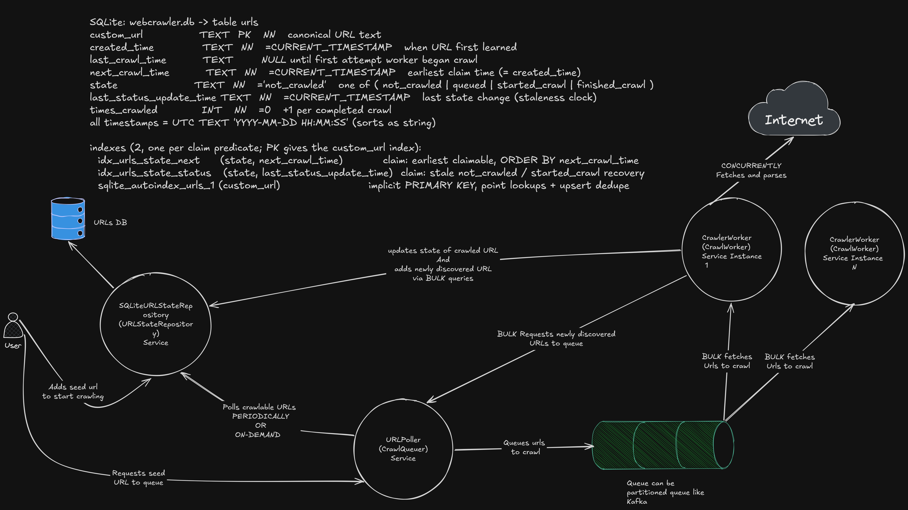

# WebCrawler

An async, single-process web crawler. Give it one seed URL; it crawls every
page on that exact host, keeps crawl state in SQLite, and moves work through a
topic queue. `Ctrl+C` stops it.

## Disclosure
- AI has been used to code it, however all the decision, code reviews, validations are owned by me. Refer [Goal.md](goal.md), [Agents.md](AGENTS.md)
- It took around 16 focussed hours to code this.
- The problem is very interesting and its open endedness along with extensibility make it very enjoyable.

## Problem Statement

Given a starting URL, visit every URL found on the same domain and print each
visited URL together with the links found on that page.

The crawl is limited to **one subdomain**: seeded from
`https://crawlme.monzo.com/` it follows `crawlme.monzo.com` links, but never
`monzo.com`, `community.monzo.com`, or `facebook.com`.

The crawler must be our own implementation. Crawling frameworks such as Scrapy
or go-colly are out of scope because they hide the crawling behind someone
else's code; using a library for HTML parsing is fine. It should be written the
way a production service would be, since the interest is in the design, the
structure, the trade-offs, the observable behaviour, the concurrency, and the
tests, rather than in presentation.

## Functional Requirements

| # | Requirement | How it is met |
|---|---|---|
| FR1 | Given a starting URL, visit each URL found on the same domain. | The seed is the only entry point; the crawl follows links outward from it and runs until interrupted. |
| FR2 | Print each URL visited, and a list of the links found on that page. | The logger writes one `INFO` line per page: the URL visited and the links extracted from it. |
| FR3 | Reject external links; the crawl is limited to one subdomain. | Scope is hostname **equality**, so a link to `monzo.com`, `community.monzo.com` or `facebook.com` is dropped and never fetched. Relative and absolute `href` values are both resolved, against the page they were found on. |

## Non-Functional Requirements

| # | Requirement | Status |
|---|---|---|
| NFR1 | **Own implementation, no crawling framework.** | Met. No crawling framework is used. |
| NFR2 | **Written as production code.** | Met. The subsequent sections on HLD and LLD can validate this|
| NFR3 | **Use concurrency.** | Met. `CrawlerWorker` fetches a whole batch in one `asyncio.TaskGroup`; `CrawlerWorkerV1` detaches a crawl per message and holds up to 1000(configurable) fetches in flight. Both on the one event loop. |
| NFR4 | **Unit tests, parameterized, with good coverage.** | Partial. 97 unit tests, 40 of them parameterized cases, every collaborator mocked. Coverage is not measured yet, so it is partial. |
| NFR5 | **Composition over inheritance, and SOLID principles.** | Met. Refer LLD section. |
| NFR6 | **Prod readiness.** | Partial Met. Besides feature flags, metrics and dashboards; we have nearly all components in the code at the very least in a basic implementation of [ports](src/webcrawler/ports/)(abstract base class). All components are plug and play. |
| NFR8 | **Async APIs wherever possible.** | Met. Nearly everything under [ports](src/webcrawler/ports/) is `async`. |
| NFR9 | **A module making I/O calls owns its retry: exponential backoff with jitter, and a timeout.** | Met. The store and the fetcher each hold a `RetryPolicy`. |
| NFR10 | **Complete signatures: every function documents its arguments, its return and the exceptions a caller must handle.** | Met. On every port method, every constructor and every method that can raise. |
| NFR12 | **Ability to handle high scale.** | Met by being modular code. The infra components like queue, db etc sit behind interfaces, so the process scales by swapping them with real components Kafka, Dynamodb etc. Also the `ports` have hints to make it scalable like partitioning etc.|
| NFR13 | **Configurability.** | Met partially. Partially as it does not have a seperate configuration class, however via [main.py](src/webcrawler/main.py#L45-L86) we can configure nearly everything in this solution.|


## High Level Design

 ([source](docs/current_crawler_HLD.png))

The above design is similar to [Apache Nutch](https://medium.com/@mobomo/the-basics-working-with-nutch-e5a7d37af231) and was independently thought and chosen over the other design, the other design was similar to this however was lacking the UrlPoller(CrawlQueuer) service, the basic idea in it was to have DB to store if the url is already crawled and add urls to crawl directly into the queue. However it was dropped due to its inability to schedule url crawl in to future due to may be [Politeness Policy](src/webcrawler/ports/politeness_policy.py) and generally to avoid overloading the worker service to queue besides crawl and parse.

The ability to schedule crawl later was helpful in crawling https://community.monzo.com which gets overwhelmed very quickly and starts giving 429s, in such case we schedule the url to for a crawl after 5 minutes(configurable). Also, crawling https://crawlme.monzo.com, https://monzo.com, amazon.in, flipkart and decathlon websites was also achieved.

## Low Level Design

### Layout

One process, one asyncio event loop, and seven modules that matter. [main.py](src/webcrawler/main.py) is
the only place that knows which implementation is in use.

| Module | One-line description |
|---|---|
| **db** ([infrastructure/db/](src/webcrawler/infrastructure/db/)) | The crawl-state store. Holds one row per URL with its state and timestamps, and owns the SQL, the transactions, and its own retry. |
| **db poller** ([application/url_poller.py](src/webcrawler/application/url_poller.py)) | Asks the store which URLs are due, marks them `queued` in one bulk statement, and feeds them to the queue. |
| **queue** ([infrastructure/queue/](src/webcrawler/infrastructure/queue/)) | Holds the pending work between the poller and the worker, as a bounded buffer with a separate parking area for messages that must not be retried. |
| **crawl worker** ([application/worker.py](src/webcrawler/application/worker.py)) | `CrawlerWorker`, the batch consumer. Takes a batch off the queue, fetches every page in it concurrently, extracts the links, records the outcome, and commits. |
| **V1 crawl worker** ([application/worker_v1.py](src/webcrawler/application/worker_v1.py)) | `CrawlerWorkerV1`, the other `CrawlWorker`. Detaches a crawl per message and commits the batch at once, so a slow page never holds new work back, and writes the store in bulk on a 10ms(configurable) timer. |
| **orchestrator** ([application/orchestrator.py](src/webcrawler/application/orchestrator.py)) | Seeds the crawl once, then runs the poller and the worker together and stops both when either fails. |
| **main** ([main.py](src/webcrawler/main.py)) | The composition root. Reads the seed and the worker's choice, constructs every object with its concrete class, runs the orchestrator, and releases everything on the way out. |


### Every major component

Four layers, each knowing only the one below it. The idea is that the middle
two are swapped out, not rewritten: the crawl is written against abstract
interfaces, and anything real can be dropped in behind them.

**[domain/](src/webcrawler/domain/)** — the vocabulary, with no I/O at all.
A URL is compared and stored as one immutable value ([`CustomURL`](src/webcrawler/domain/custom_url.py)),
so two references to the same page are the same row in the database. Everything
else here is a value or an error type: the row [states](src/webcrawler/domain/messages.py),
the frozen [retry knobs](src/webcrawler/domain/retry_settings.py) every I/O module
reads, and the exception that tells a retrying caller whether to try again.

**[ports/](src/webcrawler/ports/)** — the contracts, each one an abstract base
class, and the reason the system is swappable. There is a port for the store
([`URLStateRepository`](src/webcrawler/ports/url_state_repository.py)), for the
work queue, for fetching a page, and for the rest. They describe *what* a
component must do and never *how*.

**[infrastructure/](src/webcrawler/infrastructure/)** — the only layer that
performs real I/O, one folder per port. The store is
[SQLite](src/webcrawler/infrastructure/db/), the fetcher is
[aiohttp](src/webcrawler/infrastructure/fetch/) over a pooled session, the queue
is [in-process](src/webcrawler/infrastructure/queue/) bounded deques. Replace one
folder and the layer above cannot tell.

**[application/](src/webcrawler/application/)** — the crawl itself, and the only
layer that sequences anything. The poller asks the store what is due and feeds
the queue; the worker drains the queue and fetches. Two worker implementations
exist because it is the one decision worth arguing about: the batch
[worker](src/webcrawler/application/worker.py) waits for each batch before it
writes anything, the [non-blocking](src/webcrawler/application/worker_v1.py) one
never lets a slow page hold up the rest. Both satisfy the same
[port](src/webcrawler/ports/crawl_worker.py).

**[main.py](src/webcrawler/main.py)** — the composition root. It is the only file
that names a concrete class, which is what lets everything else stay behind an
interface.

Dependency direction, one way only:

```
domain(aka models)  <-  ports(aka interfaces)
   ^                       ^            
   +-----------------------+-------------------------->  infrastructure(aka implementations)  <-  application  <-  main.py
                                                               ^
                                                               +-->  utils
```

### UML diagram

UML diagram for the code via mermaid format. Please use apt renderer for mermaid format to view it. paste the block [`docs/uml.mmd`](docs/uml.mmd) into https://mermaid.live.

```mermaid
classDiagram
    direction TB

    %% ---------------------------------------------------------------------
    %% Ports: every interface lives in src/webcrawler/ports/ and is an ABC.
    %% ---------------------------------------------------------------------

    class CrawlWorker {
        <<abstract>>
        +run()*
        +close()*
    }

    class CrawlQueuer {
        <<abstract>>
        +run()*
        +enqueue_urls(urls, request_id)*
        +queue_candidates(now, request_id, max_items)*
    }

    class URLStateRepository {
        <<abstract>>
        +initialize()*
        +create_urls(urls)*
        +close()*
        +get_crawlable_urls(now, max_items, job_timeout, queue_timeout)*
        +claim_candidates(now, max_items, job_timeout, queue_timeout)*
        +claim_urls(urls, now, max_items, job_timeout, queue_timeout)*
        +mark_started(urls, now)*
        +complete_crawl(finished, discovered, now)*
    }

    class TopicProducer {
        <<abstract>>
        +enqueue(message, request_id)*
        +enqueue_many(messages, request_id)*
        +enqueue_to_deadletter(message, request_id)*
    }

    class TopicReader {
        <<abstract>>
        +peek(n)*
        +commit(messages, request_id)*
    }

    class WebPageFetcher {
        <<abstract>>
        +fetch(url)*
        +close()*
    }

    class LinkExtractor {
        <<abstract>>
        +extract(html, base_url) set~CustomURL~*
    }

    class PolitenessPolicy {
        <<abstract>>
        +before_fetch(url)*
        +record_fetch(now, url, result)*
    }

    class RetryPolicy {
        <<abstract>>
        +execute(operation) T*
    }

    class TimeProviderFactory {
        <<abstract>>
        +now() datetime*
    }

    class RequestMiddleware {
        <<abstract>>
        +apply(url, headers)*
    }

    %% ---------------------------------------------------------------------
    %% Domain. Three frozen dataclasses (BaseResult, BaseMessage, RetrySettings),
    %% one hand-written immutable class with __slots__ and its own __eq__ and
    %% __hash__ (CustomURL), one enum, and the exception types. domain/ imports
    %% nothing from the project except messages.py importing custom_url.py.
    %% ---------------------------------------------------------------------

    class CustomURL {
        <<value>>
        +get_url() str
        +scheme
        +hostname
        +port
        +path
        +query
    }

    class BaseMessage {
        <<value>>
        +url CustomURL
        +partition_key int
    }

    class BaseResult {
        <<value>>
        +is_success bool
    }

    class RetrySettings {
        <<value>>
        +max_attempts
        +base_delay_seconds
        +max_delay_seconds
        +jitter_seconds
        +timeout_seconds
    }

    class CrawlState {
        <<enumeration>>
        NOT_CRAWLED = not_crawled
        QUEUED = queued
        STARTED_CRAWL = started_crawl
        FINISHED_CRAWL = finished_crawl
    }

    class QueueOverflowError {
        <<error>>
    }

    class InvalidURLError {
        <<error>>
    }

    class NonRetryableError {
        <<error>>
    }

    class RetryableStatusError {
        <<error>>
    }

    class RuntimeError {
        <<builtin>>
    }

    class ValueError {
        <<builtin>>
    }

    %% ---------------------------------------------------------------------
    %% Application: the orchestrator and the two interchangeable consumers.
    %% ---------------------------------------------------------------------

    class Orchestrator {
        -URLStateRepository _repository
        -URLPoller _poller
        -CrawlWorker _worker
        -str _seed_line
        +run()
    }

    class URLPoller {
        -URLStateRepository _repository
        -TopicProducer _producer
        -TimeProviderFactory _time_provider
        +run()
        +enqueue_urls(urls, request_id)
        +queue_candidates(now, request_id, max_items)
    }

    class CrawlerWorker {
        -URLStateRepository _repository
        -TopicReader _reader
        -TopicProducer _producer
        -WebPageFetcher _fetcher
        -LinkExtractor _link_extractor
        -PolitenessPolicy _politeness_policy
        -CrawlQueuer _queuer
        -TimeProviderFactory _time_provider
        +run()
        +close()
    }

    class CrawlerWorkerV1 {
        -URLStateRepository _repository
        -TopicReader _reader
        -TopicProducer _producer
        -WebPageFetcher _fetcher
        -LinkExtractor _link_extractor
        -PolitenessPolicy _politeness_policy
        -CrawlQueuer _queuer
        -TimeProviderFactory _time_provider
        -Semaphore _fetch_slots
        -set~CustomURL~ _started
        -dict~CustomURL,datetime-or-None~ _finished
        -set~CustomURL~ _discovered
        -set~Task-of-None~ _crawling
        +run()
        +close()
    }

    %% ---------------------------------------------------------------------
    %% Infrastructure: one shipped implementation per port, except the queue
    %% which is a plain class with no interface at all.
    %% ---------------------------------------------------------------------

    class SQLiteURLStateRepository {
        -str _db_path
        -RetryPolicy _retry_policy
        -TimeProviderFactory _time_provider
        +initialize()
        +create_urls(urls)
        +close()
        +get_crawlable_urls(now, max_items, job_timeout, queue_timeout)
        +claim_candidates(now, max_items, job_timeout, queue_timeout)
        +claim_urls(urls, now, max_items, job_timeout, queue_timeout)
        +mark_started(urls, now)
        +complete_crawl(finished, discovered, now)
    }

    class AiohttpWebPageFetcher {
        -float _timeout_seconds
        -RetryPolicy _retry_policy
        -tuple _middlewares
        +fetch(url) str
        +close()
    }

    class HtmlLinkExtractor {
        +extract(html, base_url) set~CustomURL~
    }

    class NoOpPolitenessPolicy {
        +before_fetch(url) int
        +record_fetch(now, url, result)
    }

    class ExponentialBackoffRetryPolicy {
        -RetrySettings _settings
        +execute(operation) T
    }

    class SystemTimeProvider {
        +now() datetime
    }

    class HeadersMiddleware {
        +apply(url, headers)
    }

    class InMemoryTopicProducer {
        -str _topic
        -InMemorySingleTopicSinglePartitionQueue _queue
        +enqueue(message, request_id) bool
        +enqueue_many(messages, request_id) list~bool~
        +enqueue_to_deadletter(message, request_id) bool
    }

    class InMemoryTopicReader {
        -str _topic
        -str _consumer_group_id
        -InMemorySingleTopicSinglePartitionQueue _queue
        +peek(n) list~BaseMessage~
        +commit(messages, request_id)
    }

    class InMemorySingleTopicSinglePartitionQueue {
        -int _max_size
        -int _max_deadletter_size
        +enqueue(message)
        +peek(n) list~BaseMessage~
        +commit(count)
        +enqueue_deadletter(message)
    }

    %% ---------------------------------------------------------------------
    %% Composition root. The only module that names a concrete
    %% infrastructure class; orchestrator.py also names the concrete
    %% URLPoller, since it is the one port it is constructed with.
    %% `main` is a module-level function, not a class, drawn as a node so the
    %% wiring it performs has somewhere to hang.
    %% ---------------------------------------------------------------------

    class Main {
        <<module, composition root>>
        +main()
    }

    %% ---------------------------------------------------------------------
    %% Inheritance: eleven ABCs, twelve implementations.
    %% CrawlWorker is the only port with more than one.
    %% ---------------------------------------------------------------------

    CrawlWorker <|-- CrawlerWorker
    CrawlWorker <|-- CrawlerWorkerV1
    CrawlQueuer <|-- URLPoller
    URLStateRepository <|-- SQLiteURLStateRepository
    TopicProducer <|-- InMemoryTopicProducer
    TopicReader <|-- InMemoryTopicReader
    WebPageFetcher <|-- AiohttpWebPageFetcher
    LinkExtractor <|-- HtmlLinkExtractor
    PolitenessPolicy <|-- NoOpPolitenessPolicy
    RetryPolicy <|-- ExponentialBackoffRetryPolicy
    TimeProviderFactory <|-- SystemTimeProvider
    RequestMiddleware <|-- HeadersMiddleware

    %% ---------------------------------------------------------------------
    %% Held as constructor arguments.
    %% Filled `*--` = composition, exclusive ownership. Only main.py does that,
    %% because it is the module that constructs everything.
    %% Hollow `o--` = aggregation, a shared instance. One store is held by the
    %% orchestrator, the poller and whichever worker is running; one queue by
    %% both adapters; one clock by four classes. So at runtime a worker's
    %% _queuer is the very URLPoller the orchestrator holds.
    %% ---------------------------------------------------------------------

    Main *-- Orchestrator
    Main *-- SQLiteURLStateRepository
    Main *-- InMemorySingleTopicSinglePartitionQueue
    Main *-- InMemoryTopicProducer
    Main *-- InMemoryTopicReader
    Main *-- AiohttpWebPageFetcher
    Main *-- HtmlLinkExtractor
    Main *-- NoOpPolitenessPolicy
    Main *-- ExponentialBackoffRetryPolicy
    Main *-- SystemTimeProvider
    Main *-- HeadersMiddleware
    Main *-- URLPoller
    Main *-- CrawlWorker

    Orchestrator o-- URLStateRepository
    Orchestrator o-- URLPoller
    Orchestrator o-- CrawlWorker

    URLPoller o-- URLStateRepository
    URLPoller o-- TopicProducer
    URLPoller o-- TimeProviderFactory

    CrawlerWorker o-- URLStateRepository
    CrawlerWorker o-- TopicReader
    CrawlerWorker o-- TopicProducer
    CrawlerWorker o-- WebPageFetcher
    CrawlerWorker o-- LinkExtractor
    CrawlerWorker o-- PolitenessPolicy
    CrawlerWorker o-- CrawlQueuer
    CrawlerWorker o-- TimeProviderFactory

    CrawlerWorkerV1 o-- URLStateRepository
    CrawlerWorkerV1 o-- TopicReader
    CrawlerWorkerV1 o-- TopicProducer
    CrawlerWorkerV1 o-- WebPageFetcher
    CrawlerWorkerV1 o-- LinkExtractor
    CrawlerWorkerV1 o-- PolitenessPolicy
    CrawlerWorkerV1 o-- CrawlQueuer
    CrawlerWorkerV1 o-- TimeProviderFactory

    SQLiteURLStateRepository *-- RetryPolicy
    SQLiteURLStateRepository o-- TimeProviderFactory
    AiohttpWebPageFetcher *-- RetryPolicy
    AiohttpWebPageFetcher *-- RequestMiddleware
    ExponentialBackoffRetryPolicy *-- RetrySettings

    %% The only concrete-to-concrete edges in the graph. The queue has no
    %% port, so both adapters import it directly, and main.py is the only
    %% thing that guarantees both hold the same instance.
    InMemoryTopicProducer o-- InMemorySingleTopicSinglePartitionQueue
    InMemoryTopicReader o-- InMemorySingleTopicSinglePartitionQueue

    %% ---------------------------------------------------------------------
    %% Value types held or passed.
    %% ---------------------------------------------------------------------

    BaseMessage --> CustomURL : holds

    %% Raises, not extends. Dotted so the arrowhead cannot be read as
    %% inheritance: CustomURL does not inherit from InvalidURLError.
    ValueError <|-- InvalidURLError
    RuntimeError <|-- QueueOverflowError
    RuntimeError <|-- NonRetryableError
    RuntimeError <|-- RetryableStatusError

    CustomURL ..> InvalidURLError : raises
    InMemorySingleTopicSinglePartitionQueue ..> QueueOverflowError : raises
    RetryPolicy ..> NonRetryableError : re-raises at once
    RetryPolicy ..> RetryableStatusError : retried
    AiohttpWebPageFetcher ..> NonRetryableError : raises outside 200-299
    AiohttpWebPageFetcher ..> RetryableStatusError : raises on retryable status

    PolitenessPolicy ..> BaseResult : passes
    URLStateRepository ..> CustomURL : keys on
    SQLiteURLStateRepository ..> CrawlState : writes
    TopicProducer ..> BaseMessage : carries
    TopicReader ..> BaseMessage : returns
    InMemorySingleTopicSinglePartitionQueue --> BaseMessage : holds in its deques
    CrawlerWorker ..> BaseMessage : peeks, crawls, commits
    CrawlerWorkerV1 ..> BaseMessage : peeks, crawls, commits
    URLPoller ..> BaseMessage : builds one per claimed URL

    %% The implementations that key on, return, or write the domain types the
    %% ports already name above them. Drawn on both sides deliberately: the
    %% port states the contract, the implementation states the dependency.
    SQLiteURLStateRepository ..> CustomURL : keys on
    AiohttpWebPageFetcher ..> CustomURL : fetches
    HtmlLinkExtractor ..> CustomURL : returns
    NoOpPolitenessPolicy ..> CustomURL : asked about
    NoOpPolitenessPolicy ..> BaseResult : records
    HeadersMiddleware ..> CustomURL : applied per request

    %% ---------------------------------------------------------------------
    %% Notes on the parts a naive reading of the code gets wrong.
    %% ---------------------------------------------------------------------

    note for Orchestrator "Holds the concrete URLPoller,<br>not the CrawlQueuer port.<br>Closes neither the worker nor the store:<br>main.py does that in a finally block."

    note for CrawlerWorker "Batch worker, the non-default choice.<br>mark_started is AWAITED before the fetches,<br>every crawl is awaited to completion,<br>then complete_crawl, then enqueue_urls,<br>then commit LAST."

    note for CrawlerWorkerV1 "Non-blocking worker and the default choice,<br>the alternative to CrawlerWorker, never alongside it.<br>mark_started only fills a set; the store write happens in the<br>flush loop, on a timer of DEFAULT_FLUSH_INTERVAL_SECONDS.<br>commit happens as the tasks are CREATED,<br>before any crawl finishes.<br>Fetches bounded by a semaphore of DEFAULT_MAX_CONCURRENT_FETCHES,<br>not by the queue."

    note for URLPoller "Only the claim is inside try/except.<br>The enqueue_many feed is unguarded and<br>a producer failure propagates to the caller."

    note for SQLiteURLStateRepository "One of twelve classes extending a port,<br>and the only one nothing extends in turn.<br>Owns its retry, a transaction lock, and the aiosqlite connection."

    note for AiohttpWebPageFetcher "Owns its retry.<br>Middleware is a tuple applied synchronously<br>before each request, not an await point.<br>A status outside 200-299 raises, and only the seven in<br>RETRYABLE_STATUS_CODES are retried:<br>everything else, 3xx included, fails at once."

    note for InMemorySingleTopicSinglePartitionQueue "No interface and no port, the one class here with no base.<br>Both adapters aggregate over one instance,<br>and neither subclasses it.<br>peek(n) does not reserve, and commit(count) is head-based:<br>committing twice removes twice as many.<br>The deadletter half is never drained,<br>so its capacity is a memory ceiling."

    note for LinkExtractor "One of three synchronous ports,<br>with TimeProviderFactory and RequestMiddleware.<br>extract is not an await point."

    note for Main "Reads the seed, asks which worker to build,<br>constructs every object, runs the orchestrator,<br>and releases the worker then the store."
```



### Database schema

Please refer HLD diagram

DDL and DML commands in [src/webcrawler/infrastructure/db/models.py](src/webcrawler/infrastructure/db/models.py)

### [`pyproject.toml`](pyproject.toml)

The single project file; there is no `setup.py`, `requirements.txt`, or
lockfile.

| Entry | Purpose |
|---|---|
| `[build-system]` | setuptools >= 68 as the build backend. |
| `[project]` | Name, version, description, and `requires-python = ">=3.11"`. |
| `[project] dependencies` | The only two runtime packages: `aiosqlite>=0.20`, `aiohttp>=3.9`. Everything else is the standard library. |
| `[project.optional-dependencies] dev` | The `dev` extra: `pytest>=8`, `pytest-asyncio>=0.24`. Installed with `-e ".[dev]"`. |
| `[tool.setuptools.packages.find] where = ["src"]` | A src layout, so the installed package is `webcrawler` and tests import it rather than the working tree. |
| `[tool.pytest.ini_options]` | `testpaths` limits collection to `tests/`; `asyncio_mode = "auto"` lets `async def` tests run without a marker; `asyncio_default_fixture_loop_scope = "function"` gives each test its own event loop. |

`sqlite-utils` is **not** a dependency. It is only a convenience for the
inspection queries below, so it is installed separately.

## Design Decisions

The choices that are not obvious from the code, each with what it cost.

| Decision | Why | What it cost |
|---|---|---|
| Modules in folders on one event loop, not a service per module | The brief asked for a production shape without a deployment's worth of moving parts. One process means one queue, one store, and no network hop between the poller and the worker. | No horizontal scale for free. Raising throughput means more workers, which needs a broker that honours the partition key. |
| One batch, one transaction, one commit | `complete_crawl` writes every outcome and every discovered URL atomically, so a crash cannot leave a page recorded without its links. | Only a worker that waits for its batch can afford it. `CrawlerWorkerV1` never waits, so a failed write leaves its rows `started_crawl` for `job_timeout` and its snapshot is dropped. |
| `complete_crawl` before `enqueue_urls` before `commit`, in the batch worker | Each step only after the one before it is durable. `enqueue_urls` claims the rows the insert created, and `commit` acknowledges work that is only finished once recorded. | The batch worker can pay for it because it waits. `CrawlerWorkerV1` commits as its tasks are created, so it gets the throughput and gives up the ordering, recovering through `job_timeout` instead. |
| A queue timeout stands in for a CDC pipeline | If a row reaches `queued` and the process dies before the message is sent, no change-data-capture stream exists to reconcile the two. A `queued` row older than `queue_timeout` is simply re-selected. | A lost message waits out the timeout. Set to 60 minutes, because at 30s a real backlog was being re-fetched while it still waited. |
| Two retry settings, not one | A locked database frees in milliseconds; a 429 clears only on a seconds-scale window. One value fitted neither: it exhausted the whole attempt budget on backoff alone before a single page was tried. | Two constants to keep coherent, and the fetch budget must stay under `JOB_TIMEOUT` or a still-retrying URL is claimed twice. |
| A politeness wait defers, it never sleeps | One slow URL must not stall a batch, so the URL is rescheduled as `now + wait_ms` and the batch moves on. | A delaying policy is therefore not a throttle, it is a scheduler hint. Real pacing would need a per-host cap, which the brief does not ask for. |
| Two workers behind one `CrawlWorker` port, picked at the prompt | They lose in opposite directions. The batch worker is ahead when every page answers in milliseconds; the non-blocking one is far ahead when one page stalls, since the batch worker leaves its whole batch waiting. Which case a run hits is not knowable before the run. | The operator chooses per run, and the two have to be kept at behavioural parity, since the port declares them the same worker. |
| Bulk writes on a timer, not on a batch boundary | Waiting for a batch delays every write by its slowest fetch, and the non-blocking worker has no batch to wait for. | A write lands up to `flush_interval_seconds` late, and a crash inside that window leaves those rows for `job_timeout` to reclaim. The period is 10ms, which is past the knee: on a chain-shaped site 0.5s managed 20 pages in 20s where 10ms managed 335, but going from 50ms to 10ms bought only 1.4x more, because the per-page fetch and store cost starts to dominate the window. |
| Dedupe with sets and dicts, keyed by canonical URL | Two spellings of one page are the same string, so a duplicate is impossible by construction rather than something to check for. `times_crawled` can then be trusted as a re-crawl detector. | A URL that is both finished and discovered in one batch is written once, so the finish update has to win over the insert. |
| One crawlable predicate shared by the read and the claim | Two copies of that SQL would eventually disagree, and the disagreement would be silent. | None, once it is one string. |
| Bulk statements chunked under SQLite's parameter limit | A 1200-URL batch exceeds the 999 bound-parameter ceiling, so statements are chunked, each binding the remaining limit so chunking cannot overshoot `max_items`. | Bound to SQLite. Postgres has no such ceiling, so the chunking becomes unnecessary rather than wrong. |
| Empty input issues no statement | `IN ()` is rejected outright by some engines, so an empty set short-circuits. | None, and it makes the empty case cheap. |
| Retry owned by the I/O implementation | The store and the fetcher each hold a policy; the poller and the worker hold none, so nothing is retried twice. A `commit` is never retried either, being head-based, so a second attempt would remove more than the batch owns. | A caller cannot add its own retry without risking a double. |
| The in-memory queue has no lock | CPU-bound on a single event loop, and the shipped path has exactly one reader. | A second reader would need one. The `peek`/`commit` contract is already count-based, so it would not change the callers. |
| Tests mock every collaborator | A unit test that builds a real store and a real queue tests the implementation twice and breaks whenever it is refactored. | The store's own SQL is asserted through a mocked `aiosqlite` connection rather than a real database, so it is checked as calls and parameters, not as stored state. |
| 97 tests, happy path and the failure that matters | A test earns its place by naming a decision. The failing paths kept are the ones that change what happens next: a fetch that fails without stopping its batch, a `complete_crawl` that fails without enqueueing, a claim that exhausts its budget. Both workers are covered, so the port that stands between them has both sides of the contract tested. | No coverage measurement is configured, so the number is unverified. NFR4. |

## How To Run It

Assumes a fresh Mac, source only, no Python packages installed. Python 3.11 is
the floor and a stock macOS `python3` is often older; if `python3 --version`
says less, `brew install python@3.12` and use `python3.12` below.

```bash
cd /path/to/WebCrawler
python3 -m venv .venv && source .venv/bin/activate
python -m pip install --upgrade pip
python -m pip install -e ".[dev]"
```

**Run it.** It prompts for a seed URL and then for a worker; both defaults are
fine, and it explains each choice as it asks.

```bash
python -m webcrawler.main           # add --debug for DEBUG logging
```

It logs every visited page and its links, from `worker` or `worker_v1`
depending on your choice:

```
2026-09-29 21:14:34 INFO webcrawler.application.worker: visited https://crawlme.monzo.com/index.html, found 10 link(s): [...]
```

`Ctrl+C` stops it and closes the database and session.

**Verify the crawl worked.** State lives in `webcrawler.db`. `sqlite-utils` is
needed only for this step: `python -m pip install sqlite-utils`.

```bash
# rows per state, with timestamps and the crawl counter
python -m sqlite_utils query webcrawler.db "select state, count(*) as n, min(times_crawled) as min_crawled, max(times_crawled) as max_crawled, min(last_crawl_time) as first_crawl, max(last_crawl_time) as last_crawl from urls group by state" --table

# the dedupe invariant: must return no rows
python -m sqlite_utils query webcrawler.db "select custom_url, times_crawled from urls where times_crawled > 1" --table

# a sample of what was stored
python -m sqlite_utils query webcrawler.db "select custom_url, state, times_crawled, last_status_update_time from urls order by random() limit 5" --table

# consistent even after an abrupt stop
python -m sqlite_utils query webcrawler.db "pragma integrity_check" --table
```

A finished crawl of the default site ends with every row `finished_crawl` and
`max_crawled` of `1`. Rows left in `queued` or `started_crawl` were in flight
when you stopped; the timeouts reclaim them on the next run.

**Tests, then clean up.**

```bash
python -m pytest

# Ctrl+C the crawler first; lsof webcrawler.db finds a detached one holding the file
rm -f webcrawler.db
deactivate
```

Nothing else is written to the project directory besides webcrawler.db.

## Key Features

- **Exact-host scope, not suffix matching.** `notcrawlme.monzo.com` ends with
  `crawlme.monzo.com` and is still a different site, so scope is hostname
  equality.
- **One row per logical page.** Canonicalisation lowercases the scheme and
  host, drops the fragment and a scheme-default port, and sorts the query, so
  two spellings of the same URL are one row. The primary key is the canonical
  text itself, with no surrogate id.
- **One predicate for reading and claiming.** `get_crawlable_urls`,
  `claim_candidates`, and `claim_urls` share a single SQL predicate string, so
  they cannot disagree about what is crawlable. A row is claimable when it is
  new, when `next_crawl_time` has passed, or when it has been `queued` or
  `started_crawl` for longer than its timeout.
- **Timeouts stand in for a CDC pipeline.** If a row reaches `queued` but the
  process dies before the message is sent, no change-data-capture stream
  reconciles it. A row stuck in `queued` past `queue_timeout` is simply
  re-selected, and one stuck in `started_crawl` past `job_timeout` is treated
  the same way. Both are the same mechanism, so there is nothing to reconcile.
- **Dedupe at three levels.** `ON CONFLICT DO NOTHING` on insert, a dict of
  outcomes so one row is written once per batch, and a set of discovered links.
  A URL that is both finished and discovered in the same batch is written once,
  so `times_crawled` cannot jump.
- **Ordering that survives a crash.** In the batch worker the order is
  `complete_crawl`, then `enqueue_urls`, then `commit`, each step only after the
  one before it is durable, so an interrupted batch resumes rather than
  duplicating work. `CrawlerWorkerV1` deliberately inverts the outer two: it
  commits the batch as its crawl tasks are *created*, because it never waits for
  them, and recovers through `job_timeout` rather than through an ordering.
- **Politeness defers, it never sleeps.** A non-zero wait reschedules that one
  URL as `now + wait_ms` and moves on, so one slow URL cannot stall a batch, and
  a real rate-limiting policy drops in without touching the worker.
- **Two workers, one port.** `CrawlerWorker` waits for a whole batch and writes
  once at the end of it; `CrawlerWorkerV1` detaches a crawl per message, holds up
  to 1000 fetches in flight and writes the store every 10ms. `main.py` asks which
  one to build, and the orchestrator only ever calls `run` and `close`.
- **Retry belongs to the I/O modules.** The store and the fetcher each hold a
  policy; the poller and the worker hold none, so nothing is retried twice. The
  two settings differ, because a locked database frees in milliseconds while a
  429 clears only on a seconds-scale window, and one shared value exhausted the
  attempt budget on backoff alone. A non-retryable status fails on the first
  attempt, and a transport error or timeout backs off exponentially with jitter.
- **A failed URL is retried, a finished one is not.** A fetch that exhausts
  its attempts records `next_crawl_time = now + reschedule_delay`, so the row
  becomes due again in five minutes instead of spinning on a dead host, and the
  message is dead-lettered so the queue hands out that URL only once. A URL that
  *succeeds* with no re-crawl interval configured records a `NULL`
  `next_crawl_time`, which the predicate never selects, so it is never fetched
  again.
- **Indexes the database can actually use.** Staleness is compared against the
  bare column rather than a `strftime(...)` wrapper, and the epoch arithmetic
  happens on the bound parameter, so both composite indexes stay eligible. On
  the demo site this took the selection query from ~60 ms to ~8 ms.
- **Bulk statements that respect SQLite's limit.** Every bulk write is chunked
  to stay under the 999 bound-parameter ceiling, with each chunk binding the
  remaining limit so chunking cannot overshoot `max_items`. An empty input
  issues no statement at all, because `IN ()` is rejected outright.

## Test Strategy

<!--
  PLACEHOLDER - to be written.
  Cover: what is unit-tested versus integration-tested, how concurrency is (and
  is not) tested without flakiness, and how the parameterised cases are chosen.
-->

## Opportunities

Product and architecture extensions, in rough order of value.

- **Persist page bodies.** The body is parsed for its links and discarded. A
  `PageStore` port with a file-backed implementation, plus one call in the
  worker's per-URL path, would make the crawl a collector rather than only an
  indexer.
- **A real partitioned broker.** `TopicProducer` and `TopicReader` already
  carry `topic`, `consumer_group_id`, and `partition_key` and ignore them.
  Kafka, or anything else partitioned, means two new adapters: a producer that
  routes on the partition key, and a reader that reports its assignment. A
  consumer group and rebalancing appear there and are needed the moment there
  is more than one worker.
- **More than one worker.** Everything is a single consumer today. Scaling out
  means several workers sharing the queue, which needs the partition key to be
  honoured so two workers cannot claim the same URL, the store's claim already
  makes that safe, but the queue has to support it.
- **Auth and metadata middlewares.** Headers already flow through
  `RequestMiddleware`; an auth middleware is the same shape and mutates the
  header dict in place. A token that must be refreshed is a different shape,
  because it performs I/O and the port's `apply` would have to become `async`.
- **A real politeness policy.** The shipped policy reports `0` and never
  throttles. Per-host rate limiting, or a per-domain concurrency cap, is the
  same interface, and the worker needs no change to honour it.
- **Crawl directives.** `robots.txt` and `sitemap.xml` would both narrow or
  widen what is fetched. `robots.txt` in particular belongs on the fetch path
  with a cached per-host decision, not inside the extractor.
- **Content-type aware extraction.** The extractor reads every body as HTML. A
  PDF, an image, or a JSON endpoint is fetched, parsed as markup, and yields
  nothing, deciding by `Content-Type` before extraction would avoid the work
  and record a terminal result instead.
- **Scheduling policy.** A finished URL is terminal unless a re-crawl interval
  is set, and then every URL shares one interval. Per-URL importance, or
  recency-weighted selection, belongs in the predicate's ordering.
- **Graceful drain on shutdown.** `Ctrl+C` stops promptly and the rows stay
  recoverable through the timeouts. Draining the in-flight batch before exit
  would turn a recovery into a clean finish.
